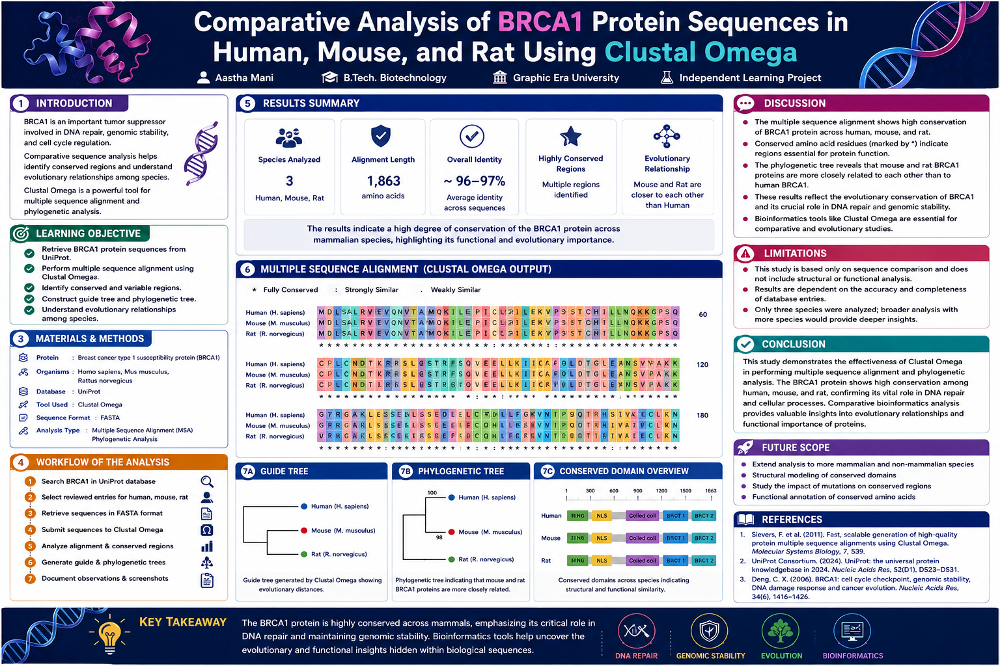

# Comparative Analysis of BRCA1 Protein Sequences Using Clustal Omega

  

## Overview
This bioinformatics project compares BRCA1 protein sequences from:
- Homo sapiens (Human)
- Mus musculus (Mouse)
- Rattus norvegicus (Rat)

using Multiple Sequence Alignment (MSA) with Clustal Omega.

## Objectives
- Retrieve BRCA1 protein sequences from UniProt
- Perform Multiple Sequence Alignment
- Identify conserved regions
- Analyze evolutionary relationships
- Generate phylogenetic trees

## Tools Used
- UniProt
- Clustal Omega
- EMBL-EBI

## Organisms Studied
- Human
- Mouse
- Rat

## Files Included
- Project report
- FASTA sequences
- Alignment screenshots
- Phylogenetic analysis

## Key Findings
- BRCA1 proteins are highly conserved across mammals
- Mouse and rat BRCA1 proteins are evolutionarily closer
- Conserved residues indicate functional importance

## Author
Aastha Mani  
B.Tech Biotechnology  
Graphic Era University
